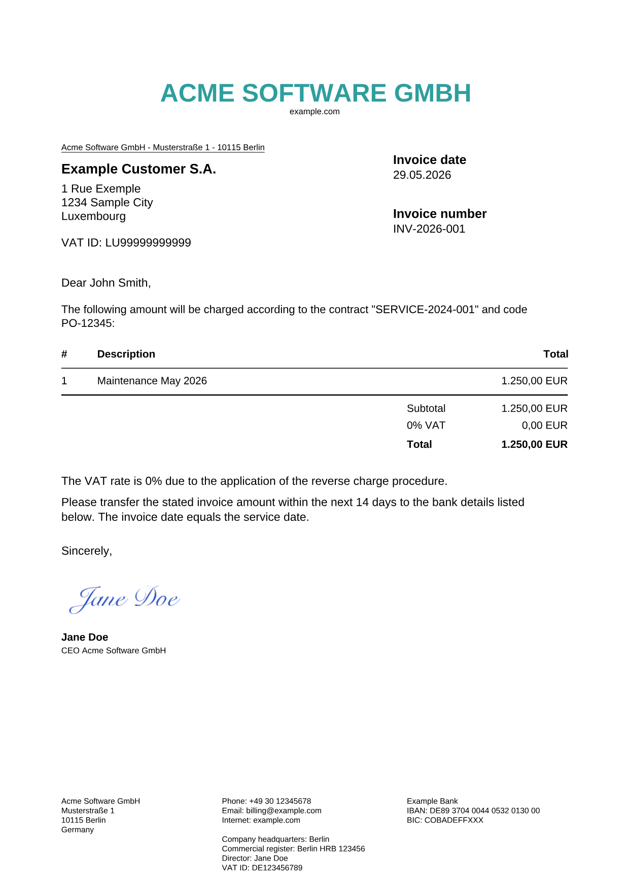

# factur-x-pdf

Generate Factur-X hybrid PDFs (ZUGFeRD / XRechnung) from a simple invoice object.

## Install

```bash
npm install factur-x-pdf
```

## Usage

```typescript
import { writeFile } from 'node:fs/promises';
import { generateXRechnungPdf, type InvoiceInput } from 'factur-x-pdf';

const invoice: InvoiceInput = {
  number: 'INV-2026-001',
  issueDateIso: '2026-05-29',
  dueDateIso: '2026-06-12',
  serviceStartIso: '2026-05-01',
  serviceEndIso: '2026-05-31',
  serviceDateIso: '2026-05-29',
  buyerReference: 'PO-12345',
  contract: 'SERVICE-2024-001',
  seller: {
    name: 'Acme Software GmbH',
    street: 'Musterstraße 1',
    postcode: '10115',
    city: 'Berlin',
    countryCode: 'DE',
    country: 'Germany',
    vatId: 'DE123456789',
    endpointSchemeId: '9930',
    phone: '+49 30 12345678',
    email: 'billing@example.com',
    website: 'example.com',
    registration: 'Berlin HRB 123456',
    director: 'Jane Doe',
  },
  buyer: {
    name: 'Example Customer S.A.',
    contact: 'John Smith',
    street: '1 Rue Exemple',
    postcode: '1234',
    city: 'Sample City',
    countryCode: 'LU',
    country: 'Luxembourg',
    vatId: 'LU99999999999',
    endpointSchemeId: '9938',
  },
  bank: {
    name: 'Example Bank',
    iban: 'DE89370400440532013000',
    ibanDisplay: 'DE89 3704 0044 0532 0130 00',
    bic: 'COBADEFFXXX',
  },
  line: {
    id: '1',
    name: 'Maintenance May 2026',
    description:
      'Maintenance May 2026 under contract SERVICE-2024-001; buyer reference PO-12345.',
    quantity: '1',
    unitCode: 'C62',
    price: '1250.00',
    net: '1250.00',
  },
  subtotal: '1250.00',
  vat: '0.00',
  total: '1250.00',
};

const pdf = await generateXRechnungPdf(invoice, { lang: 'en-us' });
await writeFile('invoice.pdf', pdf);
```

The returned PDF is a single A4 page with a human-readable invoice layout and embedded `xrechnung.xml` (XRechnung / ZUGFeRD).

## Example output

Sample invoice generated from the test fixture (`npm run test` writes fresh artifacts to `docs/`):



[Download sample PDF](docs/sample-invoice.pdf)

## Development

```bash
npm install
npm run build
npm run test
```

The PNG preview in `docs/` is regenerated during tests via [`pdf-to-png-converter`](https://www.npmjs.com/package/pdf-to-png-converter) (PDF.js + `@napi-rs/canvas`).

## License

MIT
